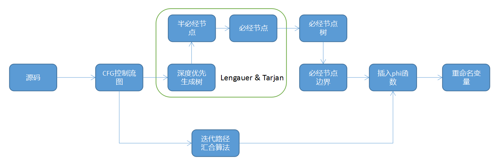
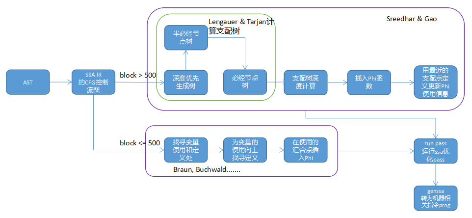

# golang生成SSA(静态单赋值)形式
### 安装包和硬件配置
- [Golang发行版安装 >= 1.14](https://golang.org/dl/)
- 硬件配置：鲲鹏(ARM64)服务器
- 源码下载：git clone https://go.googlesource.com/go
### 1. golang编译过程的SSA
golang从1.7开始使用go语言实现了原生的编译器。go编译包含的中间态包括语法树、AST(抽象语法树)、SSA、基于plan9的go汇编等中间表示(IR)。文章[Go程序编译过程](https://github.com/OptimizeLab/docs/blog/compiler/go-program-compile-process.md)
对golang编译过程进行了介绍，本文不做展开，只介绍和SSA相关的部分。
更多SSA编译原理介绍请参考：[Static Single Assignment Book](http://ssabook.gforge.inria.fr/latest/book.pdf)
- 常见的编译器从控制流图构建SSA的过程如下：
 
图中省略了词法分析、语法分析等步骤，只关注SSA生成的部分，当从源码解析出控制流图(CFG)，就可以根据上述算法获取到SSA表示形式了，具体包含两种方法：1）效率较低的迭代路径汇合(时间复杂度为n^2)；2）效率更高的Lengauer & Tarjan(时间复杂度近乎线性)；
- go从AST表示构建SSA表示流程如下图：
 
如图可以看到，golang将AST表示形式转为SSA采用了两种算法：
当block数<=500采用[1][Simple and Efficient Construction of Static Single Assignment Form](https://pp.info.uni-karlsruhe.de/uploads/publikationen/braun13cc.pdf);
当block数>500时采用[2][A Linear Time Algorithm for Placing ϕ-Nodes](https://pp.info.uni-karlsruhe.de/uploads/publikationen/braun13cc.pdf);
此处不做原理展开，感兴趣的读者请翻阅论文，下面会通过源码注释帮助理解该算法。

### 2. golang编译过程的SSA
1）执行SSA形式优化，生成go汇编的核心函数是buildssa，如下只列出其中的关键函数：
```go
func buildssa(fn *Node, worker int) *ssa.Func {
    ...........................................
    ...........................................
    ...........................................
    // 将AST(抽象语法树)形式的中间表示转为SSA形式的中间表示
    s.stmtList(fn.Func.Enter)
    s.stmtList(fn.Nbody)

    ...........................................
    ...........................................
    ...........................................

    // 插入Phi函数
    s.insertPhis()

    // 继续编译SSA形式的函数
    ssa.Compile(s.f)
    
    ...........................................

    return s.f
}

```
- insertPhis函数用于插入Phi函数：
```go
// insertPhis 找到需要插入phi的地方，插入phi
// 使用FwdRef ops找到变量使用的地方
// 使用s.defvars找到所有定义的地方
// 在phi插入后，FwdRefs被改成一个phi或定义的复制
func (s *state) insertPhis() {
    if len(s.f.Blocks) <= smallBlocks { // 对于block少于500的函数使用算法[1]
        sps := simplePhiState{s: s, f: s.f, defvars: s.defvars}
        sps.insertPhis()
        return
    }
    ps := phiState{s: s, f: s.f, defvars: s.defvars} // 对于block数大于500的函数使用算法[2]
    ps.insertPhis()
}
```
- block数<=500的情况：
```go
func (s *simplePhiState) insertPhis() {
    s.reachable = ssa.ReachableBlocks(s.f)

    // 遍历变量的使用点，找到定义处
    for _, b := range s.f.Blocks {
        for _, v := range b.Values {
            if v.Op != ssa.OpFwdRef {
                continue
            }
            s.fwdrefs = append(s.fwdrefs, v)
            var_ := v.Aux.(*Node)
            if _, ok := s.defvars[b.ID][var_]; !ok {
                s.defvars[b.ID][var_] = v // 把FwdDefs当做变量定义
            }
        }
    }

    var args []*ssa.Value

loop:
    for len(s.fwdrefs) > 0 { // 挨个处理变量使用的记录
        v := s.fwdrefs[len(s.fwdrefs)-1]
        s.fwdrefs = s.fwdrefs[:len(s.fwdrefs)-1]
        b := v.Block
        var_ := v.Aux.(*Node)
        if b == s.f.Entry {
            // entry block不应该有活跃的变量
            s.s.Fatalf("Value live at entry. It shouldn't be. func %s, node %v, value %v", s.f.Name, var_, v)
        }
        if !s.reachable[b.ID] {
            // 无需关心的dead块
            v.Op = ssa.OpUnknown
            v.Aux = nil
            continue
        }
        // 在每个前驱找变量值
        args = args[:0]
        for _, e := range b.Preds {
            args = append(args, s.lookupVarOutgoing(e.Block(), v.Type, var_, v.Pos))
        }

        // 判断是否需要插入Phi函数。如果某个变量的前驱中有两个以上的定义我们就需要phi.
        var w *ssa.Value
        for _, a := range args {
            if a == v {
                continue // 自引用
            }
            if a == w {
                continue // 已经发现的
            }
            if w != nil {
                // 发现两个，需要一个Phi函数
                v.Op = ssa.OpPhi
                v.AddArgs(args...)
                v.Aux = nil
                continue loop
            }
            w = a // 保存观察点
        }
        if w == nil {
            s.s.Fatalf("no witness for reachable phi %s", v)
        }
        // 只发现一个，让v变成w的一个复制
        v.Op = ssa.OpCopy
        v.Aux = nil
        v.AddArg(w)
    }
}
```
- block数>500的情况：
```go
func (s *phiState) insertPhis() {
    if debugPhi {
        fmt.Println(s.f.String())
    }

    // 找到所有需要匹配读和写的变量
    // 这一步排除了只属于基本块的变量
    // 为这些变量生成一个number
    s.varnum = map[*Node]int32{}
    var vars []*Node
    var vartypes []*types.Type
    for _, b := range s.f.Blocks {
        for _, v := range b.Values {
            if v.Op != ssa.OpFwdRef {
                continue
            }
            var_ := v.Aux.(*Node)

            // 优化，向上一个块找寻定义
            if len(b.Preds) == 1 {
                c := b.Preds[0].Block()
                if w := s.defvars[c.ID][var_]; w != nil {
                    v.Op = ssa.OpCopy
                    v.Aux = nil
                    v.AddArg(w)
                    continue
                }
            }

            if _, ok := s.varnum[var_]; ok {
                continue
            }
            s.varnum[var_] = int32(len(vartypes))
            if debugPhi {
                fmt.Printf("var%d = %v\n", len(vartypes), var_)
            }
            vars = append(vars, var_)
            vartypes = append(vartypes, v.Type)
        }
    }

    if len(vartypes) == 0 {
        return
    }

    // 找到我们需要处理的变量的所有定义
    // 被分配数字n的变量的所有定义块都被保存到defs[n]中
    defs := make([][]*ssa.Block, len(vartypes))
    for _, b := range s.f.Blocks {
        for var_ := range s.defvars[b.ID] {
            if n, ok := s.varnum[var_]; ok {
                defs[n] = append(defs[n], b)
            }
        }
    }

    // 创建支配树
    s.idom = s.f.Idom()
    s.tree = make([]domBlock, s.f.NumBlocks())
    for _, b := range s.f.Blocks {
        p := s.idom[b.ID]
        if p != nil {
            s.tree[b.ID].sibling = s.tree[p.ID].firstChild
            s.tree[p.ID].firstChild = b
        }
    }
    // 计算支配树高度
    // 因为有了指向父亲节点的指针无需额外空间就可以做一个深度优先遍历
    s.level = make([]int32, s.f.NumBlocks())
    b := s.f.Entry
levels:
    for {
        if p := s.idom[b.ID]; p != nil {
            s.level[b.ID] = s.level[p.ID] + 1
            if debugPhi {
                fmt.Printf("level %s = %d\n", b, s.level[b.ID])
            }
        }
        if c := s.tree[b.ID].firstChild; c != nil {
            b = c
            continue
        }
        for {
            if c := s.tree[b.ID].sibling; c != nil {
                b = c
                continue levels
            }
            b = s.idom[b.ID]
            if b == nil {
                break levels
            }
        }
    }

    // 分配临时位置
    s.priq.level = s.level
    s.q = make([]*ssa.Block, 0, s.f.NumBlocks())
    s.queued = newSparseSet(s.f.NumBlocks())
    s.hasPhi = newSparseSet(s.f.NumBlocks())
    s.hasDef = newSparseSet(s.f.NumBlocks())
    s.placeholder = s.s.entryNewValue0(ssa.OpUnknown, types.TypeInvalid)

    // 为每一个变量生成Phi函数
    for n := range vartypes {
        s.insertVarPhis(n, vars[n], defs[n], vartypes[n])
    }

    // 将变量使用解析为正确的写法或Phi函数处。
    s.resolveFwdRefs()

    // 删除存储在Phi函数AuxInt位置的变量数字，他们不再需要了
    for _, b := range s.f.Blocks {
        for _, v := range b.Values {
            if v.Op == ssa.OpPhi {
                v.AuxInt = 0
            }
        }
    }
}

// 插入Phi函数
func (s *phiState) insertVarPhis(n int, var_ *Node, defs []*ssa.Block, typ *types.Type) {
    priq := &s.priq
    q := s.q
    queued := s.queued
    queued.clear()
    hasPhi := s.hasPhi
    hasPhi.clear()
    hasDef := s.hasDef
    hasDef.clear()

    // 将定义块添加到优先队列
    for _, b := range defs {
        priq.a = append(priq.a, b)
        hasDef.add(b.ID)
        if debugPhi {
            fmt.Printf("def of var%d in %s\n", n, b)
        }
    }
    heap.Init(priq)

    // 由最深到最浅访问定义变量n的块
    for len(priq.a) > 0 {
        currentRoot := heap.Pop(priq).(*ssa.Block)
        if debugPhi {
            fmt.Printf("currentRoot %s\n", currentRoot)
        }
        // 访问定义下面的子树
        // 跳过已经处理过的子树
        // 找到被定义点支配的树离开的边 (支配边缘).
        // 在目标块插入Phi函数
        if queued.contains(currentRoot.ID) {
            s.s.Fatalf("root already in queue")
        }
        q = append(q, currentRoot)
        queued.add(currentRoot.ID)
        for len(q) > 0 {
            b := q[len(q)-1]
            q = q[:len(q)-1]
            if debugPhi {
                fmt.Printf("  processing %s\n", b)
            }

            currentRootLevel := s.level[currentRoot.ID]
            for _, e := range b.Succs {
                c := e.Block()
                if s.level[c.ID] > currentRootLevel {
                    // 一个死边，或者目标在当前根节点子树中的边
                    continue
                }
                if hasPhi.contains(c.ID) {
                    continue
                }
                // 为变量n增加一个Phi函数到块c
                hasPhi.add(c.ID)
                v := c.NewValue0I(currentRoot.Pos, ssa.OpPhi, typ, int64(n)) 
                // 注意：我们把变量数字号存在Phi的AuxInt区域. 只在Phi构建时临时使用
                s.s.addNamedValue(var_, v)
                for range c.Preds {
                    v.AddArg(s.placeholder) // 真正的参数会在函数resolveFwdRefs中被填入
                }
                if debugPhi {
                    fmt.Printf("new phi for var%d in %s: %s\n", n, c, v)
                }
                if !hasDef.contains(c.ID) {
                    // 现在块c中有了该变量的一个新定义
                    // 把它添加到优先队列用于检索
                    heap.Push(priq, c)
                    hasDef.add(c.ID)
                }
            }

            // 访问还没有访问过得孩子节点
            for c := s.tree[b.ID].firstChild; c != nil; c = s.tree[c.ID].sibling {
                if !queued.contains(c.ID) {
                    q = append(q, c)
                    queued.add(c.ID)
                }
            }
        }
    }
}

// resolveFwdRefs把所有的使用连接到他们最近的支配定义节点
func (s *phiState) resolveFwdRefs() {
    // 做一个支配树的深度优先遍历，对每一个遍历记录最近看到的值
    // 在遍历的当前点把变量ID映射到SSA值
    values := make([]*ssa.Value, len(s.varnum))
    for i := range values {
        values[i] = s.placeholder
    }

    // 用于处理的栈结构体
    type stackEntry struct {
        b *ssa.Block // 搜索的块

        // 退出时恢复的变量/值对
        n int32 // 变量ID
        v *ssa.Value
    }
    var stk []stackEntry

    stk = append(stk, stackEntry{b: s.f.Entry})
    for len(stk) > 0 {
        work := stk[len(stk)-1]
        stk = stk[:len(stk)-1]

        b := work.b
        if b == nil {
            // 从一个块退出时，本例将撤销下面完成的所有赋值
            values[work.n] = work.v
            continue
        }

        // 把Phi函数作为一个新定义。他们在这个块的使用之前。
        for _, v := range b.Values {
            if v.Op != ssa.OpPhi {
                continue
            }
            n := int32(v.AuxInt)
            // 记录旧的赋值，当退出b时可以恢复
            stk = append(stk, stackEntry{n: n, v: values[n]})
            // 记录新的分配
            values[n] = v
        }

        // 用变量的传入值替换一个FwdRef操作
        for _, v := range b.Values {
            if v.Op != ssa.OpFwdRef {
                continue
            }
            n := s.varnum[v.Aux.(*Node)]
            v.Op = ssa.OpCopy
            v.Aux = nil
            v.AddArg(values[n])
        }

        // 为b中定义的变量建立值
        for var_, v := range s.defvars[b.ID] {
            n, ok := s.varnum[var_]
            if !ok {
                // 一些变量在跨越基本块边界时不会存活
                continue
            }
            // 记录旧的赋值，这样退出b时可以恢复
            stk = append(stk, stackEntry{n: n, v: values[n]})
            // 记录新的赋值
            values[n] = v
        }

        // 用现在的传入值替换后续块中的Phi函数参数
        for _, e := range b.Succs {
            c, i := e.Block(), e.Index()
            for j := len(c.Values) - 1; j >= 0; j-- {
                v := c.Values[j]
                if v.Op != ssa.OpPhi {
                    break // 在Phi构建中，所有的Phi函数都将会在块的末尾
                }
                // 仅设置已解析的参数
                // 对于很宽的控制流图，这里能明显提升Phi处理的速度
                // See golang.org/issue/8225.
                if w := values[v.AuxInt]; w.Op != ssa.OpUnknown {
                    v.SetArg(i, w)
                }
            }
        }

        // 遍历支配树中的孩子节点
        for c := s.tree[b.ID].firstChild; c != nil; c = s.tree[c.ID].sibling {
            stk = append(stk, stackEntry{b: c})
        }
    }
}
```


### 3. SSA示例
```go
func showssa() int {
        a := 1
        b := 1
        c := 0
        for c < 100 {
                if b  < 30 {
                        b = a
                        c += 1
                } else {
                        b = c
                        c += 2
                }
        }
        return b

}
```

```bash
GOSSAFUNC=showssa go tool compile -l main.go
```
- 下图是go语言的SSA结构：
 

有几点需要注意：
1）最左边是根据block关系画出的控制流图(CFG)，可以看到每个块中包含一些语句，表示块中执行的操作；
2）v(variable)表示变量，每个变量具有一个单赋值形式，Phi函数表明有多个前驱定义了这个变量，如b2块中的v7 (8) = Phi <int> v5 v29 (c[int])，变量v7表示的是源码中的c，此处v5和v29是Phi函数的参数，他们也是SSA形式的变量，分别定义在前驱块b1和b6中；