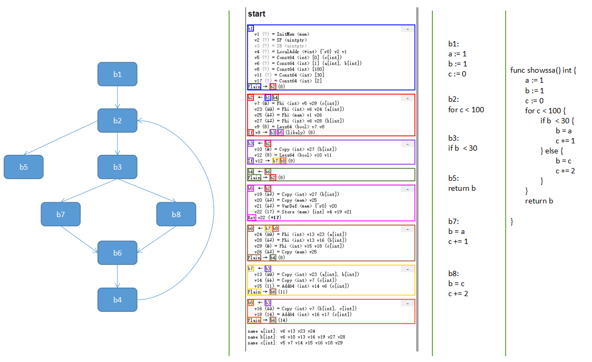
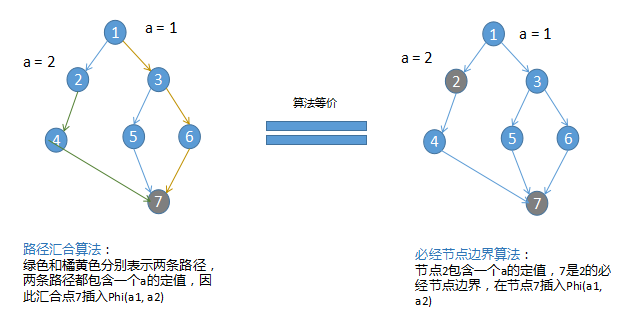
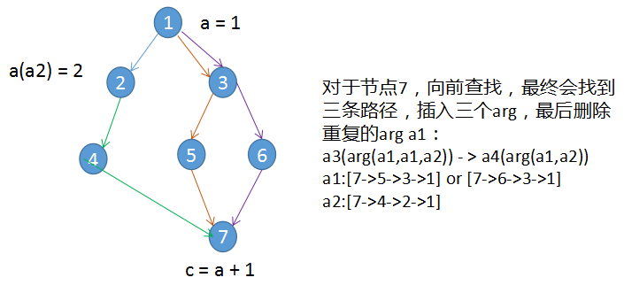
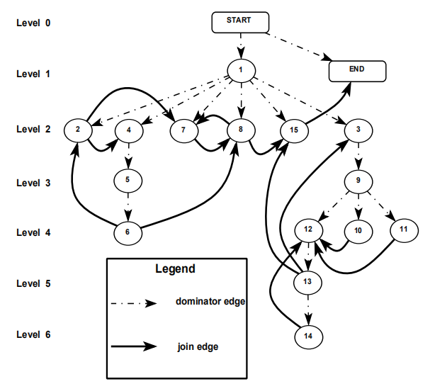

# 编译器学习-静态单赋值(SSA)形式的生成算法分析
> 静态单赋值(SSA)是编译器优化时使用的中间表示形式，本文以Go语言编译器为例，通过分析Go编译器从抽象语法树(AST)形式生成SSA形式的过程源码，帮助读者初步了解SSA的表示形式和生成算法。

在[SSA](https://baike.baidu.com/item/%E9%9D%99%E6%80%81%E5%8D%95%E8%B5%8B%E5%80%BC%E5%BD%A2%E5%BC%8F/22723427?fr=aladdin)形式中每个变量只被赋值一次，[借由简化变数的特性，来进行简化及改进编译器最佳化的结果。](https://zh.wikipedia.org/wiki/%E9%9D%99%E6%80%81%E5%8D%95%E8%B5%8B%E5%80%BC%E5%BD%A2%E5%BC%8F) Go编译器在将AST转为SSA表示形式后，会通过多轮PASS([编译器的遍](https://baike.baidu.com/item/%E7%BC%96%E8%AF%91%E7%A8%8B%E5%BA%8F/8290180))算法进行优化，包含死代码消除、分支化简、copy删除、Phi删除、降级(转为体系结构相关)、状态寄存器分配、寄存器分配等等。因此变换为SSA形式是后续编译优化的起始和前提。

### 1. SSA在编译器的应用
编译器在对代码进行优化时，通常会转为一种或几种中间态，试想一下，如果没有这个过程，对于M种语言，N个体系结构，可能需要编写M*N种编译器优化代码，开发和维护的工作量都是难以承受的。但是如果能在源码和目标体系结构之间增加一层中间表示形式，那么只需要将编程语言转为这种中间表示形式，为中间表示形式编写通用优化算法，之后再根据具体的体系结构进行优化，生成体系结构相关的表示即可。[LLVM](https://llvm.org/)正是采用了这种设计。

Go编译器也不例外，在编译过程中，它包含多个中间表示形式(IR)：语法树(syntax tree)、[AST(抽象语法树)](https://zh.wikipedia.org/wiki/%E6%8A%BD%E8%B1%A1%E8%AA%9E%E6%B3%95%E6%A8%B9)、SSA、基于plan9的Go汇编等。本文要介绍的是编译器如何生成SSA表示的相关内容，对其他编译过程感兴趣的读者可以参考文章[Go程序编译过程](https://github.com/OptimizeLab/docs/blog/compiler/go-program-compile-process.md)，该文章对Go语言的编译过程进行了总体介绍。

在Go编译器中以函数为单位表示成SSA形式，类似于下图，图中包含多个块，用b1、b2、b3.......表示，每个块中包含数量不定的表达式，生成SSA的过程需要找到变量的定义和使用，给变量的每一个定义取一个别名，使他们满足静态单赋值形式，然后为变量的每一次使用找到定义点，如图中所示，但是会出现图中块b4不能确定x定义的情况，即在某一个使用的汇合点不确定到底使用的是哪个定义，这时就需要插入Phi函数，他表示在这个使用点还不确定究竟使用哪一个定义，定义点来源作为到这里就保持了每个变量只被定义一次的特性：

 

如下是一个Go语言编译过程SSA的示例：

```go
func showssa() int {
        a := 1
        b := 1
        c := 0
        for c < 100 {
                if b  < 30 {
                        b = a
                        c += 1
                } else {
                        b = c
                        c += 2
                }
        }
        return b

}
```

使用[Go compile](https://golang.google.cn/cmd/compile/)工具获得该函数SSA形式的控制流图如下：

```bash
GOSSAFUNC=showssa go tool compile -l main.go
```

 

上图左侧第一幅是根据Block关系画出的控制流图(CFG)，可以看到每个块中包含一些语句，表示块中执行的操作；

图中的v(variable)表示变量，每个变量具有一个静态单赋值形式，Phi函数表明有多个前驱定义了这个变量，如b2块中的v7 (8) = Phi <int> v5 v29 (c[int])，变量v7表示的是源码中的c，此处v5和v29是Phi函数的参数，他们也是SSA形式的变量，分别定义在前驱块b1和b6中。


### 2. 生成SSA表示的算法

如下是两种经典SSA生成算法，从控制流图(CFG)出发，分别是1. 效率较低的迭代路径汇合算法，时间复杂度为n^2；2. 效率更高的Lengauer & Tarjan算法，通过计算必经节点边界来插入Phi函数，时间复杂度近乎线性，下图中省略了词法分析、语法分析等步骤，只关注两种生成SSA表示的算法：

 

两种算法的核心点如下简图，路径汇合算法是从变量的使用处向上找寻定义块的算法，Lengauer&Tarjan算法是通过计算必经节点边界来插入Phi函数的算法：

 


- Go编译器从AST表示生成SSA表示的流程如下图：

 

如图可以看到，Go编译器根据块的数量不同采用了两种算法：

1. 当count(block) <= 500时采用算法[Simple and Efficient Construction of Static Single Assignment Form](https://pp.info.uni-karlsruhe.de/uploads/publikationen/braun13cc.pdf)。找到所有变量的定义和使用处，对于每个变量的每个使用，从前驱节点找寻他的定义，如果找到多个定义则插入Phi函数，否则是一个拷贝。

 

2. 当count(block) > 500时采用算法[A Linear Time Algorithm for Placing ϕ-Nodes](https://pp.info.uni-karlsruhe.de/uploads/publikationen/braun13cc.pdf)。该算法使用了一种有效的、近似线性的算法。首先构造了一个DJ-graph结构图，他在支配树的基础上增加了深度值Level和Join-edge(J-edge，是满足条件的边：存在一条边x->y，且x不严格支配y)，从深度最高向深度最低的节点遍历，对于每个节点x(如图中12)，如果在以x为根节点的子树中存在某个节点y(如图中13)，y节点有一条到子树外部节点z(如图中3和15)的J-edge边，且z的Level小于x的Level，则在节点z插入Phi函数。

 

感兴趣的读者可以继续阅读论文来深入理解，下面会通过源码注释帮助理解该算法的Go实现版本。
更多SSA编译原理介绍请参考文章：[Static Single Assignment Book](http://ssabook.gforge.inria.fr/latest/book.pdf)


### 3. Go编译器生成SSA的源码分析
本章源码分析主要讲述从编译器生成AST后，将AST转为SSA形式的过程，可以理解为两个关键过程：1. 包含Node的抽象语法树转为包含块和Value的控制流图；2. 插入Phi函数

`[注]由于代码数量庞大，因此只列出了利于理解关键过程的部分代码。

1. 将抽象语法树转为SSA形式，并执行PASS进行代码优化的核心函数是buildssa：

```go
func buildssa(fn *Node, worker int) *ssa.Func {

    ...........................................

    // 将AST(抽象语法树)形式的中间表示转为SSA形式的中间表示
    s.stmtList(fn.Func.Enter)
    s.stmtList(fn.Nbody)

    ...........................................

    // 插入Phi函数
    s.insertPhis()

    // 对SSA形式的函数进行优化
    ssa.Compile(s.f)
    
    ...........................................

    return s.f
}
```

2. 将语法树转为SSA形式，在AST中使用节点(Node)表示操作，在SSA形式中使用块(Block)和值(Value)：

```go
// stmtList 将AST中的Node列表转为SSA形式的块(Block)和值(Value)
func (s *state) stmtList(l Nodes) {
	for _, n := range l.Slice() {
		s.stmt(n)
	}
}

// stmt 将Node转为SSA形式.
func (s *state) stmt(n *Node) {
....................................................
// 判断类型，处理一些复杂的类型，从Syntax的Node形式转为SSA形式
// 对于部分包含多条语句的类型，如IF，可能递归调用stmtList，并生成多个块
	switch n.Op {

	case OBLOCK:
		s.stmtList(n.List)

	case OEMPTY, ODCLCONST, ODCLTYPE, OFALL:
....................................................
	case OCALLFUNC:
....................................................
	case OCALLMETH, OCALLINTER:
....................................................
	case ODEFER:
....................................................
	case OGO:
....................................................
....................................................
// 需要注意的是，对于一些复杂类型如IF，会生成多个块
// 分别表示：if判断本身；判正的分支；判负的分支
	case OIF:
		if Isconst(n.Left, CTBOOL) {
			s.stmtList(n.Left.Ninit)
			if n.Left.Bool() {
				s.stmtList(n.Nbody)
			} else {
				s.stmtList(n.Rlist)
			}
			break
		}

		bEnd := s.f.NewBlock(ssa.BlockPlain)
		var likely int8
		if n.Likely() {
			likely = 1
		}
		var bThen *ssa.Block
		if n.Nbody.Len() != 0 {
			bThen = s.f.NewBlock(ssa.BlockPlain)
		} else {
			bThen = bEnd
		}
		var bElse *ssa.Block
		if n.Rlist.Len() != 0 {
			bElse = s.f.NewBlock(ssa.BlockPlain)
		} else {
			bElse = bEnd
		}
		s.condBranch(n.Left, bThen, bElse, likely)

		if n.Nbody.Len() != 0 {
			s.startBlock(bThen)
			s.stmtList(n.Nbody)
			if b := s.endBlock(); b != nil {
				b.AddEdgeTo(bEnd)
			}
		}
		if n.Rlist.Len() != 0 {
			s.startBlock(bElse)
			s.stmtList(n.Rlist)
			if b := s.endBlock(); b != nil {
				b.AddEdgeTo(bEnd)
			}
		}
		s.startBlock(bEnd)

	case ORETURN:
....................................................
	case ORETJMP:
....................................................
	case OCONTINUE, OBREAK:
....................................................
	case OFOR, OFORUNTIL:
....................................................
	case OSWITCH, OSELECT:
....................................................
	case OVARDEF:
....................................................
	case OVARKILL:
....................................................
	case OVARLIVE:
....................................................
	case OCHECKNIL:
....................................................
	case OINLMARK:
....................................................
	default:
		s.Fatalf("unhandled stmt %v", n.Op)
	}
}

// stmt调用的关键函数是expr，该函数将Node表达式转为SSA的Value值
func (s *state) expr(n *Node) *ssa.Value {
....................................................
	switch n.Op {
// 类型转换string([]byte)
	case OBYTES2STRTMP:
		slice := s.expr(n.Left)
		ptr := s.newValue1(ssa.OpSlicePtr, s.f.Config.Types.BytePtr, slice)
		len := s.newValue1(ssa.OpSliceLen, types.Types[TINT], slice)
		return s.newValue2(ssa.OpStringMake, n.Type, ptr, len)
// 类型转换([]byte)(str)
	case OSTR2BYTESTMP:
		str := s.expr(n.Left)
		ptr := s.newValue1(ssa.OpStringPtr, s.f.Config.Types.BytePtr, str)
		len := s.newValue1(ssa.OpStringLen, types.Types[TINT], str)
		return s.newValue3(ssa.OpSliceMake, n.Type, ptr, len, len)
// c函数指针
	case OCFUNC:
		aux := n.Left.Sym.Linksym()
		return s.entryNewValue1A(ssa.OpAddr, n.Type, aux, s.sb)
// 变量名或函数名
	case ONAME:
		if n.Class() == PFUNC {
			// value是函数的闭包地址
			sym := funcsym(n.Sym).Linksym()
			return s.entryNewValue1A(ssa.OpAddr, types.NewPtr(n.Type), sym, s.sb)
		}
		if s.canSSA(n) {
			return s.variable(n, n.Type)
		}
		addr := s.addr(n)
		return s.load(n.Type, addr)
// 闭包函数初始的变量
	case OCLOSUREVAR:
		addr := s.addr(n)
		return s.load(n.Type, addr)
....................................................
// 类型转换
	case OCONVNOP:
....................................................	
	case OCONV:
....................................................
// 二进制操作符
	case OLT, OEQ, ONE, OLE, OGE, OGT:
....................................................	
// 算术运算	
	case OMUL:
....................................................		
	case ODIV:
....................................................			
	case OADD, OSUB:
....................................................	
// 	bit操作符
	case OAND, OOR, OXOR:
....................................................		
	case OLSH, ORSH:
....................................................
// && 和 ||		
	case OANDAND, OOROR:
....................................................
// 一元运算符
	case ONEG:
....................................................
	case ONOT, OBITNOT:
....................................................
	case OIMAG, OREAL:
....................................................
	case OPLUS:
....................................................
// 索引
    case OINDEX:
....................................................
// slice和map等内置结构的len和cap
	case OLEN, OCAP:
....................................................
// 一些内置结构和操作
	case OSLICE, OSLICEARR, OSLICE3, OSLICE3ARR:
....................................................
	case OCALLFUNC:
....................................................
	case OGETG:
....................................................
	case OAPPEND:
....................................................
	case OSTRUCTLIT, OARRAYLIT:
....................................................
	case ONEWOBJ:
....................................................
	default:
		s.Fatalf("unhandled expr %v", n.Op)
		return nil
	}
}
```

3. 在生成SSA控制流图后，其实目前并不符合静态单赋值形式，因此还需要insertPhis函数插入Phi函数：

```go
// insertPhis 找到需要插入Phi的地方，插入Phi
// 使用s.fwdrefs找到变量所有使用的地方
// 使用s.defvars找到变量所有定义的地方
// 在Phi插入后，每个变量的使用将被改成Phi或定义的复制
func (s *state) insertPhis() {
    if len(s.f.Blocks) <= smallBlocks { 
        // 对于block少于500的函数使用算法：
        // Simple and Efficient Construction of Static Single Assignment Form
        sps := simplePhiState{s: s, f: s.f, defvars: s.defvars}
        sps.insertPhis()
        return
    }
    ps := phiState{s: s, f: s.f, defvars: s.defvars} 
    // 对于block数大于500的函数使用算法
    // A Linear Time Algorithm for Placing ϕ-Nodes
    ps.insertPhis()
}
```

4. count(block) <= 500时的算法：

```go
func (s *simplePhiState) insertPhis() {
    s.reachable = ssa.ReachableBlocks(s.f)

    // 遍历变量，搜集定义和使用信息
    for _, b := range s.f.Blocks {
        for _, v := range b.Values {
            if v.Op != ssa.OpFwdRef {
                continue
            }
            s.fwdrefs = append(s.fwdrefs, v)
            var_ := v.Aux.(*Node)
            if _, ok := s.defvars[b.ID][var_]; !ok {
                s.defvars[b.ID][var_] = v // 把FwdDefs当做变量定义
            }
        }
    }

    var args []*ssa.Value

loop:
    for len(s.fwdrefs) > 0 { // 遍历变量使用点
        v := s.fwdrefs[len(s.fwdrefs)-1]
        s.fwdrefs = s.fwdrefs[:len(s.fwdrefs)-1]
        b := v.Block
        var_ := v.Aux.(*Node)
        if b == s.f.Entry {
            // 入口块中不应该有活跃的变量
            s.s.Fatalf("Value live at entry. It shouldn't be. func %s, node %v, value %v", s.f.Name, var_, v)
        }
        if !s.reachable[b.ID] {
            // 无需关心的dead块
            v.Op = ssa.OpUnknown
            v.Aux = nil
            continue
        }
        // 在每个前驱找变量值
        args = args[:0]
        for _, e := range b.Preds {
            args = append(args, s.lookupVarOutgoing(e.Block(), v.Type, var_, v.Pos))
        }

        // 判断是否需要插入Phi函数。
        // 如果变量使用点的前驱中有两个以上的定义就需要Phi函数
        var w *ssa.Value
        for _, a := range args {
            if a == v {
                continue // 自引用
            }
            if a == w {
                continue // 已经发现的
            }
            if w != nil {
                // 发现某个变量的两个不同定义，需要一个Phi函数
                v.Op = ssa.OpPhi
                v.AddArgs(args...)
                v.Aux = nil
                continue loop
            }
            w = a // 保存观察点
        }
        if w == nil {
            s.s.Fatalf("no witness for reachable phi %s", v)
        }
        // 只发现一个有效的参数，让v变成w的一个复制
        v.Op = ssa.OpCopy
        v.Aux = nil
        v.AddArg(w)
    }
}

// 查找
func (s *simplePhiState) lookupVarOutgoing(b *ssa.Block, t *types.Type, var_ *Node, line src.XPos) *ssa.Value {
	for {
		if v := s.defvars[b.ID][var_]; v != nil {
			return v
		}
        // 变量var_不在块b定义，且还没处理过
        // 如果b只有一个前驱，则循环向上遍历
        // 如果b的前驱>=2，则插入一个变量使用记录，在后续处理中再修复
		if len(b.Preds) != 1 {
			break
		}
		b = b.Preds[0].Block()
..............................................
	}
	// 生成一个变量var_的记录并返回，在父函数中会继续处理
	v := b.NewValue0A(line, ssa.OpFwdRef, t, var_)
	s.defvars[b.ID][var_] = v
	s.s.addNamedValue(var_, v)
	s.fwdrefs = append(s.fwdrefs, v)
	return v
}

```

5. count(block) > 500时的算法：

```go
func (s *phiState) insertPhis() {
.................................................
    // 找到所有变量的使用
    // 为这些变量生成一个数字标号
    s.varnum = map[*Node]int32{}
    var vars []*Node
    var vartypes []*types.Type
    for _, b := range s.f.Blocks {
        for _, v := range b.Values {
            if v.Op != ssa.OpFwdRef {
                continue
            }
            var_ := v.Aux.(*Node)

            // 如果只有一个前驱块，则找寻变量v的定义w
            // 如果找到则将变量v改为w的copy
            if len(b.Preds) == 1 {
                c := b.Preds[0].Block()
                if w := s.defvars[c.ID][var_]; w != nil {
                    v.Op = ssa.OpCopy
                    v.Aux = nil
                    v.AddArg(w)
                    continue
                }
            }

            if _, ok := s.varnum[var_]; ok {
                continue
            }
            s.varnum[var_] = int32(len(vartypes))
            if debugPhi {
                fmt.Printf("var%d = %v\n", len(vartypes), var_)
            }
            vars = append(vars, var_)
            vartypes = append(vartypes, v.Type)
        }
    }

    if len(vartypes) == 0 {
        return
    }

    // 找到我们需要处理的变量n的所有定义
    // 所有定义变量n的块都被保存到defs[n]中
    defs := make([][]*ssa.Block, len(vartypes))
    for _, b := range s.f.Blocks {
        for var_ := range s.defvars[b.ID] {
            if n, ok := s.varnum[var_]; ok {
                defs[n] = append(defs[n], b)
            }
        }
    }

    // 创建支配树
    s.idom = s.f.Idom()
    s.tree = make([]domBlock, s.f.NumBlocks())
    for _, b := range s.f.Blocks {
        p := s.idom[b.ID]
        if p != nil {
            s.tree[b.ID].sibling = s.tree[p.ID].firstChild
            s.tree[p.ID].firstChild = b
        }
    }
    // 根据支配树计算每个块的深度Level
    // 因为有了指向父节点的指针无需额外空间就可以做一个深度优先遍历
    s.level = make([]int32, s.f.NumBlocks())
    b := s.f.Entry
levels:
    for {
        if p := s.idom[b.ID]; p != nil {
            s.level[b.ID] = s.level[p.ID] + 1
            if debugPhi {
                fmt.Printf("level %s = %d\n", b, s.level[b.ID])
            }
        }
        if c := s.tree[b.ID].firstChild; c != nil {
            b = c
            continue
        }
        for {
            if c := s.tree[b.ID].sibling; c != nil {
                b = c
                continue levels
            }
            b = s.idom[b.ID]
            if b == nil {
                break levels
            }
        }
    }

    // 分配临时存储
    s.priq.level = s.level
    s.q = make([]*ssa.Block, 0, s.f.NumBlocks())
    s.queued = newSparseSet(s.f.NumBlocks())
    s.hasPhi = newSparseSet(s.f.NumBlocks())
    s.hasDef = newSparseSet(s.f.NumBlocks())
    s.placeholder = s.s.entryNewValue0(ssa.OpUnknown, types.TypeInvalid)

    // 为每一个变量生成Phi函数
    for n := range vartypes {
        s.insertVarPhis(n, vars[n], defs[n], vartypes[n])
    }

    // 将变量使用解析为正确的写法或Phi函数。
    s.resolveFwdRefs()

    // 删除存储在Phi函数AuxInt位置的变量数字，他们不再需要了
    for _, b := range s.f.Blocks {
        for _, v := range b.Values {
            if v.Op == ssa.OpPhi {
                v.AuxInt = 0
            }
        }
    }
}

// 插入Phi函数
func (s *phiState) insertVarPhis(n int, var_ *Node, defs []*ssa.Block, typ *types.Type) {
    priq := &s.priq
    q := s.q
    queued := s.queued
    queued.clear()
    hasPhi := s.hasPhi
    hasPhi.clear()
    hasDef := s.hasDef
    hasDef.clear()

    // 将定义块添加到优先队列
    for _, b := range defs {
        priq.a = append(priq.a, b)
        hasDef.add(b.ID)
        if debugPhi {
            fmt.Printf("def of var%d in %s\n", n, b)
        }
    }
    // 初始化大顶堆，按块的Level排序
    heap.Init(priq)

    // 由最深到最浅访问定义变量n的块
    for len(priq.a) > 0 {
        currentRoot := heap.Pop(priq).(*ssa.Block)
        if debugPhi {
            fmt.Printf("currentRoot %s\n", currentRoot)
        }
        // 访问定义下面的子树
        // 跳过已经处理过的子树
        // 找到支配边界
        // 在目标块插入Phi函数
        if queued.contains(currentRoot.ID) {
            s.s.Fatalf("root already in queue")
        }
        q = append(q, currentRoot)
        queued.add(currentRoot.ID)
        for len(q) > 0 {
            b := q[len(q)-1]
            q = q[:len(q)-1]
            if debugPhi {
                fmt.Printf("  processing %s\n", b)
            }

            currentRootLevel := s.level[currentRoot.ID]
            for _, e := range b.Succs {
                c := e.Block()
                if s.level[c.ID] > currentRootLevel {
                    // 一个死边，或者目标在当前根节点子树中的边
                    continue
                }
                if hasPhi.contains(c.ID) {
                    continue
                }
                // 为变量n在块c中增加一个Phi函数
                hasPhi.add(c.ID)
                v := c.NewValue0I(currentRoot.Pos, ssa.OpPhi, typ, int64(n)) 
                // 变量数字号存在Phi的AuxInt区域，只在Phi构建时临时使用
                s.s.addNamedValue(var_, v)
                for range c.Preds {
                    v.AddArg(s.placeholder) // 真正的参数会在函数resolveFwdRefs中被填入
                }
                if debugPhi {
                    fmt.Printf("new phi for var%d in %s: %s\n", n, c, v)
                }
                if !hasDef.contains(c.ID) {
                    // 现在块c中有了该变量的一个新定义
                    // 把它添加到大顶堆中用于检索
                    heap.Push(priq, c)
                    hasDef.add(c.ID)
                }
            }

            // 访问还没有访问过当前块的孩子块
            for c := s.tree[b.ID].firstChild; c != nil; c = s.tree[c.ID].sibling {
                if !queued.contains(c.ID) {
                    q = append(q, c)
                    queued.add(c.ID)
                }
            }
        }
    }
}

// resolveFwdRefs建立变量的使用和他的最近支配节点中定义的关系
func (s *phiState) resolveFwdRefs() {
    // 做一个支配树的深度优先遍历，记录每个变量最近看到的值
    ........................................................
    // 暂存变量在遍历中当前点的值
    values := make([]*ssa.Value, len(s.varnum))
	for i := range values {
		values[i] = s.placeholder
	}
    // 用于处理的栈结构体
    type stackEntry struct {
        b *ssa.Block // 搜索的块

        // 退出时恢复的变量/值对
        n int32 // 变量ID
        v *ssa.Value
    }
    var stk []stackEntry

    stk = append(stk, stackEntry{b: s.f.Entry})
    for len(stk) > 0 {
     // 以块为单位处理，在退出一个块时会把值复原
     ...........................................
     ...........................................

        // 用变量的传入值替换一个FwdRef操作
        for _, v := range b.Values {
            if v.Op != ssa.OpFwdRef {
                continue
            }
            n := s.varnum[v.Aux.(*Node)]
            v.Op = ssa.OpCopy
            v.Aux = nil
            v.AddArg(values[n])
        }

       ..........................................

        // 修改后继块中的Phi函数参数
        // Phi函数的参数就是当前块中定义变量的地方
        for _, e := range b.Succs {
            c, i := e.Block(), e.Index()
            for j := len(c.Values) - 1; j >= 0; j-- {
                v := c.Values[j]
                if v.Op != ssa.OpPhi {
                    break // 在Phi构建中，所有的Phi函数都将会在块的末尾
                }
                // 仅设置已解析的参数
                // 对于很宽的控制流图，这里能明显提升Phi处理的速度
                if w := values[v.AuxInt]; w.Op != ssa.OpUnknown {
                    v.SetArg(i, w)
                }
            }
        }

        // 遍历支配树中的孩子块
        for c := s.tree[b.ID].firstChild; c != nil; c = s.tree[c.ID].sibling {
            stk = append(stk, stackEntry{b: c})
        }
    }
}
```

### 4. 总结
可以看到Go编译器生成SSA表示形式的算法是一种图的算法，输入是抽象语法树的控制流图，输出是满足静态单赋值形式(SSA)的图结构，对于变量多个定义的汇合点，变量被改写成了Phi函数，他的参数是上面的定义。