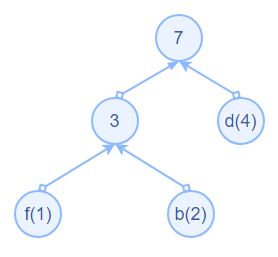
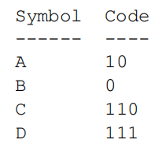
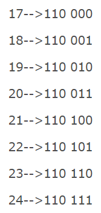
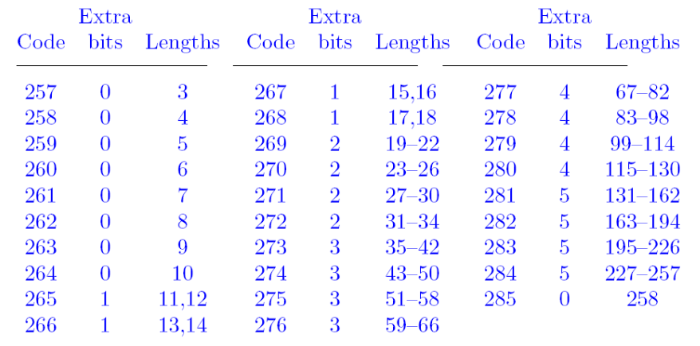

# Go语言压缩库算法 - deflate算法介绍

在Go语言压缩库中，deflate算法是一个重要的算法，是多个压缩格式的核心算法。deflate算法由[LZ77](https://baike.baidu.com/item/LZ77%E7%BC%96%E7%A0%81)压缩和[Huffman](https://baike.baidu.com/item/%E5%93%88%E5%A4%AB%E6%9B%BC%E7%BC%96%E7%A0%81/1719730?fromtitle=HUFFMAN%E7%BC%96%E7%A0%81&fromid=364674&fr=aladdin)编码组成。接下来，我们对deflate算法以及其组成算法进行原理介绍。

### （1）Huffman编码介绍

​	哈夫曼编码(Huffman Coding)，又称霍夫曼编码，是一种编码方式。Huffman于1952年提出一种编码方法，该方法依据字符出现的概率对所有字符进行重新编码。详细的说就是该编码方法通过构造哈夫曼树把文件中的内容看作是符号，根据这些符号在文件中出现的频率对符号进行重新编码。对于出现次数非常多的，我们用较少的位来表示，对于出现次数非常少的，我们用较多的位来表示。这样一来，文件的一些部分位数变少了，一些部分位数变多了，由于变小的部分比变大的部分多，所以整个文件的大小还是会减小，所以文件得到了压缩。

​	建立哈夫曼树是进行哈夫曼编码的关键，首先对文件进行频率统计出现的次数，根据次数建立哈夫曼树，通过哈夫曼树得到哈夫曼编码。

​	示例：

​	例如通过对一个文件中的字符进行统计，发现文件中的字符：a,b,c,d,e,f出现的频率分别为8,2,6,4,5,1。那么就可以建立哈夫曼树，方法如下;

​	首先选取出现频率最低的两个符号，b(2), f(1)，父节点就是两者的频率之和，如图所示：


​	然后选取除了这两个符号的最小频率d(4)，与上面树的频率进行比较，较小的值放在左边，较大的值放在右边，再次进行搭建，如图所示：



​	重复这个过程，就可以得到最终的哈夫曼树：


​	在树上定义左支上为0， 右支上为1。如图：


​	这样我们就得到了对各个字符的哈夫曼编码：


​	树的建立方法保证了两点：1，频率大的符号所用的编码位数少；2，由于所有符号都是在树上的叶子节点，所以，各符号之间的编码没有包含关系，不会发生歧义。

### （2）LZ77压缩介绍

​	LZ77算法由Jacob Ziv 和 Abraham Lempel 于 1977 年提出，所以命名为 LZ77。

​	LZ77的算法压缩原理为：如果文件中有两块内容相同的话，那么只要知道前一块的位置和大小，我们就可以确定后一块的内容。所以我们可以用（两者之间的距离，相同内容的长度）这样一对信息，来替换后一块内容。如果替换之后的内容小于替换之前的内容那么就对文件进行了压缩。

​	示例：

```
http://www.google.com  http://www.baidu.com
```

​	在上面的字符中，在两个位置出现了相同的内容（http://www. 和 .com），对后面这些相同的内容就可以用（距离， 长度）进行表示。第二个h距离第一个h的距离为23，相同内容的长度为11，那么“http://www.”就可以表示为（23，11），后面的重复内容同理。

​	Lz77压缩之后为：

```
http://www.google.com  (23,11)baidu(39,4)
```

​	LZ77从文件的开始处开始，一个字节一个字节的向后进行处理。一个固定大小的窗口（在当前处理字节之前，并且紧挨着当前处理字节），随着处理的字节不断的向后滑动。对于文件中的每个字节，用当前处理字节开始的串和窗口中的每个串进行匹配，寻找最长的匹配串。如果当前处理字节开始的串在窗口中有匹配串，就用(匹配距离，匹配长度) 这样一对信息，来替换当前串，然后从刚才处理完的串之后的下一个字节，继续处理。如果当前处理字节开始的串在窗口中没有匹配串，就不做改动的输出当前处理字节。


在实际的应用中，我们会固定“匹配距离”和“匹配长度”的编码位数表示。如果要固定匹配距离，就需要使用固定的窗口的大小，Go语言压缩库中的窗口限定为32K大小，即15位表示。那么用15位就可以表示0-32K范围内的任何一个值。另外，还需要定义最小匹配长度，因为如果匹配的字符串太小的话，可能用“距离，长度” 表示后的字符大小比未进行替代时的大，这样对于压缩来说会起到反作用。如果在一个32K的窗口中表示“匹配距离”用15位进行表示，那么最小匹配长度为3个字节。

### （3）deflate算法

deflate算法由上面两种算法组成，对输入文件首先进行LZ77压缩，然后对得到的结果再进行Huffman编码处理。在deflate算法中，基本的思想是基于LZ77和Huffman算法原理，但是对LZ77算法和Huffman编码的一些实现细节有需要重点介绍一下。

在lz77压缩算法中，有一个重要的操作是匹配滑动窗口和缓冲区之间相同的匹配字符。在进行字符串匹配的时候，最小的匹配长度是3个字节。如果每次寻找匹配串的时候都要和之前的每一个串的至少3个字节进行匹配的话，那么计算量是非常大的，在实际的算法实践中，为了提高匹配速度，使用了哈希算法。

首先建立一个哈希表。然后对每一个串中的头三个字节，进行哈希算法计算。得到的值就是插入位置ins_hash。简单地说就是用三个字节确定一个插入位置。在哈希表head中保存三个字节的开始地址head[ins_hash]。

如果在计算时，遇到了另外的三个字节，这三个字节与之前的三个字节是一样的。同样的哈希算法，同样的字节，得到的哈希值也是一样的。这时在哈希表中得到之前计算的值，从而得到之前的字符串的位置索引。这样就得到了一个匹配串。

如果有多个串，这些串的前3个字节都相同，那么他们字典的位置也都是相同的，这时这些串将会放在一个链表中。

我们需要建立一个数组prev[]用来存放哈希值相同的串的位置。head[ins_hash] 中的值，有两个作用。一个作用，是一个前三个字节计算结果为ins_hash的串的位置。另一个作用，是一个在prev[]数组中的索引，用这个索引在prev[]中，将找到前一个前三个字节计算结果为ins_hash的串的位置。即prev[head[ins_hash]]的值（不为空的话）为前一个前三个字节计算结果为ins_hash的串的位置。prev[]的值，也有两个作用。一个作用，是一个前三个字节计算结果为ins_hash的串的位置。另一个作用，是一个在prev[]数组中的索引，用这个索引在prev[]中，将找到前一个前三个字节计算结果为ins_hash的串的位子。即prev[]的值（不为空的话）为前一个三个字节计算结果为ins_h的串的位置。

举一个简单的例子。有一个简单的字符串：

```go 
0xyz xyza xyzab xyzabc
```

​	当处理到xyzabc的时候，计算出xyz的哈希值ins_hash；

​	这时head[ins_hash]的值为15，也是就是字符串xyzabc的位置；

​	这时的prev[15]的值为9，也是就是字符串xyzab xyzabc的位置；

​	这时的prev[9]的值为4，也是就是字符串xyza xyzab xyzabc的位置；

​	这时的prev[4]的值为1，也是就是字符串xyz xyza xyzab xyzabc的位置；

​	这时的prev[1]的值为0，也是就是表示链表结束了；

​	在这个例子中，我们看到，前三个字符为xyz的字符串被连接到了一块。

`注：`

​	`对于第0个字符，有特殊性。他的位置是0，所以在这个位置之后的三个字符计算出的ins_hash，在head[ins_hash]中保存的位置为0,。对于是否有可能有匹配的判断，就是通过head[ins_hash]不为0，并且head[ins_hash]的值为一个串的开始位置。所以第0字节开始的串，由于其特殊性，将不会被用来匹配，不过这种情况只会出现在第0个字节，所以通常不会造成影响，即使影响，也会极小。`

​	`所以在匹配的时候，不会对第一个字符进行匹配。`

​	`例如。有字符串：`

```
abcdefg abcdefgh
```

​	`找到的匹配就是(括号中的就是找到的匹配项)：`

```
abcdefg a[bcdefg]h
```


对于Huffman编码，Go语言压缩库中deflate算法使用的是一种特定的Huffman树。例如，当对文件中的内容字符：A，B， C，D进行使用频率统计之后可以建立一个Huffman树，如图所示：


但是在上述的图中，01的位置是完全可以互换的，不会影响编码的长度，那么这个树就会有不同的形式，那么采用什么样的形式是最合理的情况呢？在deflate中选择了最特殊的一棵树，称为deflate树。如图所示：


相比于一般的哈夫曼树，这里多了两条附加条件：

1. 给定位长的所有代码在字典上具有连续的值，其顺序与所代表的符号相同；

2. 在字典上，较短的代码在较长的代码之前。

   这时，符号的编码发生了变化：



那么定义了这棵树带来了什么改变吗？如果定义了这种特殊的树，那就可以只记录编码长度就可以对字符进行表示了。比如上图中，就可以表示A - 2. B - 1. C - 3， D - 3。这样我们记录这个对应关系就可以了。这是这个算法的最核心的一点：用码字长度序列将这棵码树记录下来。

当然，只把1、2、3、3这个序列记录下来还不行，比如不知道111对应C还是对应D。所以，构造出树来只是知道了有哪些码字了，但是这些码字到底对应哪些整数还是不知道。在deflate算法中，按照字符使用ASCII码表示的大小顺序对长度进行排序。比如说，在上面的例子中，ABCD对应的长度记录为2，1，3，3，而不是1，2，3，或者,3，3，2，1或者3，3，1，2。

关于字符编码的问题解决了之后，还有一个问题。由于滑动窗口的大小为32K，那么“距离”的表示范围是0  -  32768，在实际的处理中不会对其中的每一个数都进行使用，因为不可能出现如此多的匹配，那么对重复内容的“距离”怎么表示会好一点？

在deflate算法中，distance划分成了多个区间，每个区间都当做一个整数来看待，这个这个整数称为Distance Code。当一个distance落到某个区间，则相当于是出现了那个Code，多个distance对应于一个Distance Code，Distance虽然很多，但Distance Code可以划分得很少，只要我们对Code进行Huffman编码，得到Code的编码后，Distance Code再根据一定规则扩展出来。那么，划分区间的依据是什么呢？按照压缩时候的情况来说，一般相匹配的字符串出现在近处的概率比较大，那么划分区间的依据并不是等间距的，而是距离当前处理字节近的地方密一点，距离远的地方稀疏一点。在这份[格式要求](https://tools.ietf.org/html/rfc1951#page-13)中，对区间进行了如下划分：


1、2、3、4这四个特殊distance不划分，或者说1个Distance就是1个区间；5,6作为一个区间；7、8作为一个区间等等，越往后，涵盖的距离越多。距离越小出现频率越高，所以距离值小的时候，划分密一些，可以对小的距离进行更精细地编码，使得其编码长度与其出现次数尽量匹配；对于距离较大那些，因为出现频率低，所以可以适当放宽一些。另一个原因是，只要知道这个区间Code的码字，那么对于这个区间里面的所有distance，后面追加相应的多个比特即可，比如，17-24这个区间的Huffman码字是110，因为17-24这个区间有8个整数，于是按照下面的规则即可获得其distance对应的码字：



在算法中，将32768这个范围内切割成一下30种区间。这是算法本身的格式所定义的。这里的extra位为在哈夫曼编码位数后面的添加的位数。2位可以表示4个数，3位可以表示8个数。


关于距离我们解释完了，然后我们说一下剩下的字符和长度表示，字符最多有256种可能。匹配的”长度“有大小限制，当相同的匹配长度小于3时那么这个内容就没有用（距离，长度）表示的必要。但是也不是越长越好，同样限定最长的长度为256。在deflate算法中，这两个整数是共用一套哈夫曼码表的。为什么共用一套哈夫曼表呢？因为当解码器接收到一个比特流的时候，首先可以按照literal/length这个码表来解码，如果解出来是0-255，就表示未匹配字符，如果是256，那自然就结束，如果是257-285之间，则表示length，把后面扩展比特加上形成length后，后面的比特流肯定就表示distance，因此，实际上通过一个Huffman码表，对各类情况进行了统一，而不是通过加一个什么标志来区分到底是literal还是重复字符串。

定义了30个额外的位。字符用255个字节表示，如果解码遇到了256，则表示解码结束。从257开始表示length，257表示length = 3； 258表示 length = 4；以此类推。在deflate中也将这几种值划分了30个不同的区间，具体情况如下图所示。




