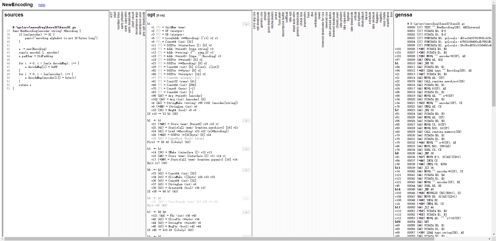

# Go 在ARM64开发环境配置

### 1. 在ARM64服务器上配置开发环境

Go语言开发包是go语言的实现，内容包括版本的语法、编译、运行、标准库以及其他一些必要资源。

1） Go语言包官网：https://golang.google.cn/dl/。

2） 下载打开页面之后根据自己的需求选择对应平台下载，本次安装选择[go1.14.2.linux-arm64](https://dl.google.com/go/go1.14.2.linux-arm64.tar.gz) ,是发行版1.14.2对应linux系统、arm64处理器架构的特定版本。如下图所示：


3） 进入你的linux平台，进入你存放安装包的目录下，输入命令：

```linux
wget https://dl.google.com/go/go1.14.2.linux-arm64.tar.gz
```

进行下载，下载结果如图所示。


4） 执行tar解压到/usr/local目录下（官方推荐)，得到go文件夹。

```linux
tar -C /usr/local -zxvf go1.14.2.linux-arm64.tar.gz
```

得到go文件夹内容，结果如图所示：


5） 配置环境变量，输入命令：

```linux
export GOROOT=/usr/loacl/go
export PATH=$PATH:$GOROOT/bin
```

6） 输入以下命令就可以得到你的版本号：

```linux
go version
```

7） 新建一个工作目录并且创建第一个工程目录：

```linux
#创建工作空间
mkdir $HOME/go
#编辑 ~/.bash_profile 文件
#将你的工作目录声明到环境变量中
export GOPATH=$HOME/go
#保存退出后source一下
source ~./bash_profile
#之后创建并进入你的第一个目录
mkdir -p $GOPATH/hello && cd $GOPATH/src/hello
```

8） 在工作目录下创建名为hello.go 的文件。内容如下：

```go
package main

import "fmt"

func main() {
	fmt.Printf("hello, world\n")
}
```

9） 使用命令：go build hello.go，来构建然后使用命令：./hello来运行。


10） 到这里Go语言开发环境就准备完毕了


### 2 .使用[Go benchmark](https://golang.google.cn/pkg/testing/)获取性能分析

benchmark基准测试是测量一个程序在固定工作负载下的性能。在Go语言中，基准测试以Benchmark为前缀并且带有一个 *testing.B 类型的参数。

#### 1).Go源码包中有对应的基准测试程序

基准测试的代码文件必须以_test.go结尾，基准测试的函数必须以Benchmark开头。

首先进入文件目录：

```
go/src
```

在对标准库的函数进行基准测试的时候可以在命令行执行以下命令，就可以执行你指定的包中所有以Benchmark开头的测试文件：

```
go test xxx/yyy -v -bench ^Benchmark -benchmem -count n -run ^$ >> zzz.txt
```

`注：`

`-bench：它指明要测试的函数`

`xxx/yyy：表示进行基准测试的包所在的目录文件，例如：math/bits；`

`-benchmem：表示性能测试的时候显示测试函数的内存分配大小，内存分配次数的统计信息`

`n：表示对测试执行几次基准测试`

`zzz.txt：表示将计算得到的信息保存在zzz.txt文件中；`

#### 2).Go源码包中没有对应的基准测试程序

如果在Go标准库中并没有指定函数的基准测试，或者你需要自己写一个函数的基准测试，那么你需要满足以下规则：

1. 基准测试的代码文件必须以_test.go结尾，基准测试函数以Benchmark开头；

2. 基准测试函数只有一个参数，即b *testing.B，且无返回值，那么基准测试名为：

   ```
   func BenchmarkFUNCNAME(b *testing.B)
   ```

3. 将被测试的代码放在最后的循环中

4. 自己编写基准测试程序举例如下：

   ```go
   package test
   
   import (
       "testing"
   )
   
   func add(a, b int) int {
       return a + b
   }
   
   func BenchmarkAdd(b *testing.B) {
       for i := 0; i < b.N; i++ {
           _ = add(i, i)
       }
   }
   ```

然后保存文件。

进入文件所在目录下，在命令行输入以下命令：

```
go test -v -bench ^Benchmark . -benchmem -count n -run ^$ >> xxx.txt
```

`注：`

`. ：表示是测试当前所有以Benchmark为前缀函数`

`n：表示测试样本数据`

`xxx.txt：表示将测试结果存储在xxx.txt文件中`


### 3  .使用[Go pprof](https://golang.google.cn/pkg/runtime/pprof/)工具进一步分析性能

通过 Go 提供的性能分析工具 pprof 操作 cpu.out 文件，我们可以查看并分析对 cpu 性能消耗大的函数。

```
// 进入以下目录
go/src
// 在命令行输入以下命令
go test xxxx -v -bench ^Benchmarkyyyy$ -run ^$ -cpuprofile=cpu.out
```

`注：`

`xxxx：表示想要获得的函数所在的包名`

`Benchmarkyyyy：其中yyyy表示测试的函数的名`

`cpuprofile=cpu.out：表示将测试的结果保存在cpu.out中`

然后我们可以通过以下命令来查看CPU的使用信息：

```
go tool pprof cpu.out
// 在弹出的框中输入以下命令查看对CPU消耗最大的前n个函数
top n
// 再输入以下命令可以查看函数内部详细的耗时信息
list xxxx
```

`注：`

`n：表示前n项，可自己指定`

`xxxx：xxxx表示函数名`

示例：

在go/src目录下，命令行输入命令：

```
go test bytes -v -bench ^BenchmarkEqual$ -run ^$ -cpuprofile=cpu.out
```

获得以下信息：

```
goos: linux
goarch: arm64
pkg: bytes
BenchmarkEqual/0-8      500000000                3.66 ns/op
BenchmarkEqual/1-8      200000000                9.44 ns/op      105.98 MB/s
BenchmarkEqual/6-8      200000000                9.83 ns/op      610.54 MB/s
BenchmarkEqual/9-8      100000000                10.7 ns/op      844.26 MB/s
BenchmarkEqual/15-8     100000000                10.4 ns/op     1441.79 MB/s
BenchmarkEqual/16-8     200000000                9.91 ns/op     1614.26 MB/s
BenchmarkEqual/20-8     100000000                12.0 ns/op     1667.08 MB/s
BenchmarkEqual/32-8     100000000                11.4 ns/op     2799.28 MB/s
BenchmarkEqual/4K-8     10000000                  212 ns/op    19319.24 MB/s
BenchmarkEqual/4M-8     2000                   614830 ns/op     6821.89 MB/s
BenchmarkEqual/64M-8    200                   6779486 ns/op     9898.81 MB/s
PASS
ok      bytes   21.121s
```

然后，命令行输入以下命令：

```
go tool pprof cpu.out
top 5
```

那么就可以获得以下信息：

```bash
File: bytes.test
Type: cpu
Time: Aug 26, 2020 at 3:55pm (CST)
Duration: 21.02s, Total samples = 20.86s (99.26%)
Entering interactive mode (type "help" for commands, "o" for options)
(pprof) top 5
Showing nodes accounting for 20800ms, 99.71% of 20860ms total
Dropped 24 nodes (cum <= 104.30ms)
Showing top 5 nodes out of 8
      flat  flat%   sum%        cum   cum%
    8930ms 42.81% 42.81%     8930ms 42.81%  memeqbody
    3920ms 18.79% 61.60%    18600ms 89.17%  bytes_test.bmEqual.func1
    3750ms 17.98% 79.58%    16210ms 77.71%  bytes.Equal
    3530ms 16.92% 96.50%     3530ms 16.92%  internal/bytealg.Equal
     670ms  3.21% 99.71%     2200ms 10.55%  bytes_test.BenchmarkEqual.func1
```

此处 " top 5 " 列出了 cpu 消耗前 5 的函数。其中各项含义如下：

- flat：当前函数占用CPU的耗时  
- flat%: 当前函数占用CPU的耗时百分比  
- sun%：函数占用CPU的耗时累计百分比  
- cum：当前函数加上调用当前函数的函数占用CPU的总耗时  
- cum%：当前函数加上调用当前函数的函数占用CPU的总耗时百分比  
- 最后一列：函数名称  

然后输入命令，就可以查看指定的函数memeqbody详细的耗时情况：

```bash
list memeqbody
```


### 4. 使用[Go benchstat](https://github.com/golang/perf/tree/master/cmd/benchstat)对比优化前后的性能数据

benchstat是Go官方推荐的一款命令行工具，可以针对一组或多组样本进行分析，如果同时分析两组样本（比如优化前和优化后），还可以给出性能变化结果。

在命令行输入以下命令进行安装：

```
go get golang.org/x/perf/cmd/benchstat
```

在上面的benchmark介绍章节中，我们已经使用benchmark工具输出了性能测试的结果TXT文件。如果你对代码进行优化修改之后想查看优化之后的性能结果，那么你可以使用benchstat工具对优化前后的测试结果进行对比。

```bash
benchstat old.txt new.txt
```

`注：`

`old.txt：表示优化前的benchmark测试结果`

`new.txt：表示优化后的benchmark测试结果`

在[官方](https://github.com/golang/perf/tree/master/cmd/benchstat)这个例子中给出了，工具使用举例。

示例：

如果优化前的benchmark性能测试文件为old.txt， 并且信息如下：

```
BenchmarkGobEncode   	100	  13552735 ns/op	  56.63 MB/s
BenchmarkJSONEncode  	 50	  32395067 ns/op	  59.90 MB/s
BenchmarkGobEncode   	100	  13553943 ns/op	  56.63 MB/s
BenchmarkJSONEncode  	 50	  32334214 ns/op	  60.01 MB/s
BenchmarkGobEncode   	100	  13606356 ns/op	  56.41 MB/s
BenchmarkJSONEncode  	 50	  31992891 ns/op	  60.65 MB/s
BenchmarkGobEncode   	100	  13683198 ns/op	  56.09 MB/s
BenchmarkJSONEncode  	 50	  31735022 ns/op	  61.15 MB/s
```

优化后benchmark测试文件名为new.txt， 并且信息如下：

```
BenchmarkGobEncode   	 100	  11773189 ns/op	  65.19 MB/s
BenchmarkJSONEncode  	  50	  32036529 ns/op	  60.57 MB/s
BenchmarkGobEncode   	 100	  11942588 ns/op	  64.27 MB/s
BenchmarkJSONEncode  	  50	  32156552 ns/op	  60.34 MB/s
BenchmarkGobEncode   	 100	  11786159 ns/op	  65.12 MB/s
BenchmarkJSONEncode  	  50	  31288355 ns/op	  62.02 MB/s
BenchmarkGobEncode   	 100	  11628583 ns/op	  66.00 MB/s
BenchmarkJSONEncode  	  50	  31559706 ns/op	  61.49 MB/s
BenchmarkGobEncode   	 100	  11815924 ns/op	  64.96 MB/s
BenchmarkJSONEncode  	  50	  31765634 ns/op	  61.09 MB/s
```

那么就可以使用benchstat工具对优化前后的性能进行对比，输入命令：

```
benchstat old.txt new.txt
```

则会得到性能对比信息：

```
name        old time/op  new time/op  delta
GobEncode   13.6ms ± 1%  11.8ms ± 1%  -13.31% (p=0.016 n=4+5)
JSONEncode  32.1ms ± 1%  31.8ms ± 1%     ~    (p=0.286 n=4+5)
```

`注：`

`GobEncode/JSONEncode：为测试函数名`

`time/op：表示每操作的耗时信息`

`± 1%：表示离散值`

`delta：表示性能差值百分比`

`(p=0.016 n=4+5)：p表示可信度，值越小，可信程度越高，n表示样本数量`


### 5.使用GOSSAFUNC查看函数在编译过程中的优化以及结果

在Go代码执行过程中，Go编译器会对代码进行多次优化，最后转化为底层汇编程序在各个架构上执行。很多时候我们需要查看优化过程中程序的变化情况，或者是最终的汇编结果。

Go编译器提供了非常方便的功能，可以查看函数在编译过程中的代码变化以及汇编结果。

在想要查看的函数目录下，输入命令：

```
GOSSAFUNC=xxxx go build yyyy.go
```

`注：`

`xxxx：表示想要查看的函数名`

`yyyy：表示函数所在的文件名`

点击之后，会在当前目录下生成一个ssa.html文件，使用浏览器打开即可查看各个优化过程中代码变化情况。

示例：

进入Go目录：

```
go/src/encoding/base32
```

输入命令，运行：

```
GOSSAFUNC=NewEncoding go build base32.go
```

生成一个ssa.html文件，用浏览器打开。便可得到编译过程中的代码优化情况以及汇编程序，如图所示：


