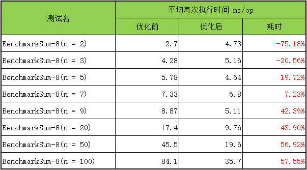

## 基于ARM流水线优化

#### 安装包和源码准备

- Golang语言包
- 鲲鹏（ARM64）服务器

#### 1，整数n求和的性能问题分析

或许你刚开始学习编程的时候会接触一道题，给定整数n，求n以内所有数字的和。你可以这样写：

```go
func sum(n int) int {
	ans := 0
	for i := n; i > 0; i-- {
		ans += i
	}
	return ans
}
```

但是程序存在一个很大的优化空间，为了能够找到优化的空间，可以进入下层汇编层面进行观察：

```assembly
// func sum(n int) int
TEXT ·Sum(SB), $0-8
	MOVD   n+0(FP), R1 	// 将int n 放入寄存器
	MOVD   $0, R2		// 初始化寄存器R2为0
	CMP    $0, R1		// 比较n的值和0的大小
	BEQ    END              // 如果n == 0，就跳转到END

LOOP:
	ADD    R1, R2, R2	// R2 = R1 + R2
	SUB    $1, R1		// R1 = R1 - 1
	CMP    $0, R1		// 比较R1和0的大小
	BEQ    END 	        // 如果n == 0，就跳转到L_END
	B      LOOP		// 如果R1的值大于0，就继续循环
	
END:
	MOVD   R2, res+8(FP)	 // 返回R2寄存器的值
	RET
```

在上面的程序中，可以看到，只用了3个寄存器，每次循环执行只能完成一个数字的加法操作：先是对数据读取、计算相减、计算相加完成一个数字的操作，但是这种效率低下。那么是否在这里应用流水线操作进行优化？

#### 2，基于流水线优化方案

那么什么是流水线原理呢？流水线指的是程序在执行的过程中，多条指令重叠进行操作的一种准并行处理的技术，通过多个功能部件并行工作来缩短程序的执行时间。

ARM7处理器核使用了典型三级流水线的冯·诺伊曼结构，ARM9系列则采用了基于五级流水线的哈佛结构。通过增加流水线级数简化了流水线各级的逻辑，进一步提高了处理器的性能。简单来说，在三级流水线中每条指令的执行过程分为：取指、译码、执行，三个步骤。取指部件完成从存储器装载指令；译码部件产生需要的控制信号，完成寄存器的解码；执行部件完成寄存器的读取、运算及运算结果的返回。如果采用这种方法去执行指令，那么需要耗费3个指令周期才能完成一个数值的操作，效率低下。所以，可以利用多个寄存器进行计算操作，一次完成多个数据的读取。在完成数据的读取后，在另外的寄存器上完成数据的计算和存储。更详细的流水线信息请进入官网查看：https://developer.arm.com/docs/dvi0027/b/arm7tdmi/instruction-pipeline

那么针对上面的计算流程我们可以利用多个寄存器，多个指令重叠进行操作。通过多个功能部件并行工作来缩短程序的执行时间。当求和的数值大于8时，可以选择每次计算8个数值的和，每个数值的计算在不同的寄存器中进行，每次批量处理数据；当整型数n小于8时，每次处理4个数值的操作，以此类推。
我们这里采用华为鲲鹏处理器运行，华为鲲鹏处理器兼容Armv8指令集，关于指令集详细信息可以参考：https://static.docs.arm.com/ddi0487/fb/DDI0487F_b_armv8_arm.pdf。；关于流水线可以参考：https://static.docs.arm.com/swog307215/a/Arm_Cortex-A76_Software_Optimization_Guide.pdf

##### 优化后的代码详解

```assembly
// func sum(n int) int
TEXT ·Sum2(SB), $0-8
	MOVD    n+0(FP), R8		// 同上
	MOVD    $0, R9			// 以下将不同的数值0-8放入不同的寄存器中备用
	MOVD    $0, R10
	MOVD    $1, R11
	MOVD    $2, R12
	MOVD    $3, R13
	MOVD    $4, R14
	MOVD    $5, R15
	MOVD    $6, R16
	MOVD    $7, R17
	MOVD    $8, R19	
	CBZ   	R8, END   		// 如果整数n == 0， 则跳转END
	
STEP1:
	CMP		R19,  R8	// 如果整数n > 8, 就跳转到LOOP8
	BGE		LOOP8       
	CMP		R14, R8		// 如果整数4 < n < 8, 就跳转到LOOP4
	BGE		LOOP4
	CMP		R12, R8		// 如果整数2 < n < 4, 就跳转到LOOP2
	BGE		LOOP2
	CMP		R11, R8		// 如果整数0 < n < 2, 就跳转到LOOP1
	BGE		LOOP1
	B        END			// 如果n == 0，跳转到END
	
LOOP8:
	SUB		R10, R8, R0	// 每次执行将相同的操作放在一起， R0 = R8 - R10
	SUB		R11, R8, R1	// R1 = R8 - R11, 以下同理
	SUB		R12, R8, R2
	SUB		R13, R8, R3
	SUB		R14, R8, R4
	SUB		R15, R8, R5
	SUB		R16, R8, R6
	SUB		R17, R8, R7
	
	ADD		R0, R1, R0	// R0 = R0 + R1
	ADD		R2, R3, R2
	ADD		R4, R5, R4
	ADD		R6, R7, R6
	
	ADD		R0, R2, R0
	ADD		R4, R6, R4
	
	ADD		R0, R4, R0
	ADD		R0, R9, R9
	SUB		$8, R8		// R8 = R8 - 8
	B		STEP1		// 跳转到STEP1继续进行判断
	
LOOP4:
	SUB		R10, R8, R0
	SUB		R11, R8, R1
	SUB		R12, R8, R2
	SUB		R13, R8, R3
	
	ADD		R0, R1, R0
	ADD		R2, R3, R2
	
	ADD		R0, R2, R0
	ADD		R0, R9, R9
	SUB     $4, R8
	B		STEP1
	
LOOP2:
	SUB		R10, R8, R0
	SUB		R11, R8, R1
	
	ADD		R0, R1, R0
	
	ADD		R0, R9, R9
	SUB     $2, R8
	B		STEP1
	
LOOP1:	
	ADD		R8, R9, R9
	MOVD  	R9, result+8(FP)	// 执行完所有的值之后，返回结果
	RET
	
END:
	MOVD  	R9, result+8(FP)
	RET
```

#### 3，结果验证对比

我们分别进行的不同数值2、3、5、7、9、20、50、100下的求和运算，得到了优化前后的执行时间，可以发现，数值较大时，耗时有一定程度的下降，并且随着数值的增加，优化效果更好。


