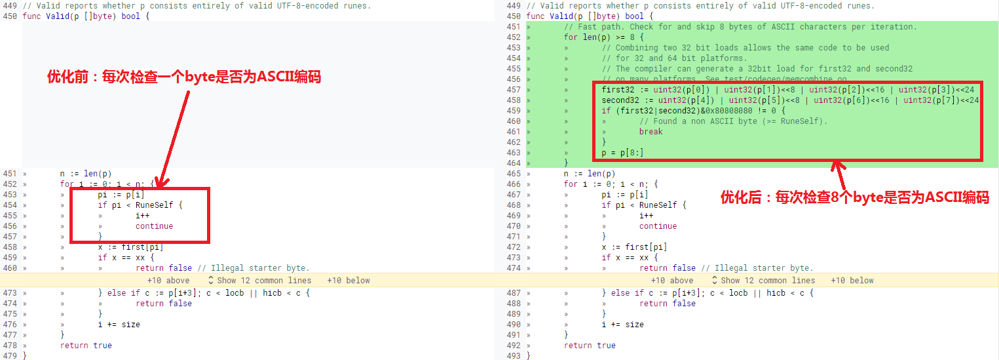

## 算法优化案例
### 1. 特殊输入的归并排序算法改进
### 1.1 数据块只有一个元素时的归并排序的性能问题
golang/sort包支持[归并排序算法](https://zh.wikipedia.org/wiki/%E5%BD%92%E5%B9%B6%E6%8E%92%E5%BA%8F)，采用递归法实现。
递归实现的归并算法对时间和栈空间的消耗较大,而对于数据块大小为1的归并排序,使用递归反而增加了计算的复杂度。
比如说有序数据块{2}和{1,3,4}的归并排序，直接使用二分插入法把数据{2}插入有序序列{1,3,4}，比使用递归重复调用自身函数要简单的多。
  
### 1.2 使用二分查找插入排序优化归并排序的性能问题  

通过分析社区优化方法：[sort: optimize symMerge performance for blocks with one element](https://go-review.googlesource.com/c/go/+/2219)，
发现该优化方法在数据块只有一个元素时，直接使用二分插入法替换递归调用实现排序，即使用二分查找算法找到元素的插入位置，插入元素到有序数据块即可实现两个数据块的归并排序，避免递归调用，提高了算法性能。
- [二分查找算法](https://zh.wikipedia.org/wiki/%E4%BA%8C%E5%88%86%E6%90%9C%E5%B0%8B%E6%BC%94%E7%AE%97%E6%B3%95)
- 环境配置请参考案例 [Golang在ARM64开发环境配置](../del-env-pre/del-env-pre.md)  

#### 1.2.1 优化前后对比

  

#### 1.2.2 优化代码解读  
   data[a:m]和data[m:b]是两个待归并的有序切边，如果 `m-a==1`，表示data[a:m]只有一个元素，可以使用二分查找插入排序将元素data[a] 插入有序的data[m:b]切片；如果 `b-m==1`，表示data[m:b]只有一个元素，可以使用二分查找插入排序将元素data[b-1]
   插入有序的data[a:m]切片。此时，symMerge归并排序算法的时间复杂度为 log<sub>2</sub>N，而优化前的symMerge归并排序算法的时间复杂度为nlog<sub>2</sub>N，性能得以优化。
   ```go
    func symMerge(data Interface, a, m, b int) {
    	// Avoid unnecessary recursions of symMerge
    	// by direct insertion of data[a] into data[m:b]
    	// if data[a:m] only contains one element.
    	if m-a == 1 {
    		// Use binary search to find the lowest index i
    		// such that data[i] >= data[a] for m <= i < b.
    		// Exit the search loop with i == b in case no such index exists.
    		i := m
    		j := b
    		for i < j {
    			h := int(uint(i+j) >> 1)
    			if data.Less(h, a) {
    				i = h + 1
    			} else {
    				j = h
    			}
    		}
    		// Swap values until data[a] reaches the position before i.
    		for k := a; k < i-1; k++ {
    			data.Swap(k, k+1)
    		}
    		return
    	}
    
    	// Avoid unnecessary recursions of symMerge
    	// by direct insertion of data[m] into data[a:m]
    	// if data[m:b] only contains one element.
    	if b-m == 1 {
    		// Use binary search to find the lowest index i
    		// such that data[i] > data[m] for a <= i < m.
    		// Exit the search loop with i == m in case no such index exists.
    		i := a
    		j := m
    		for i < j {
    			h := int(uint(i+j) >> 1)
    			if !data.Less(m, h) {
    				i = h + 1
    			} else {
    				j = h
    			}
    		}
    		// Swap values until data[m] reaches the position i.
    		for k := m; k > i; k-- {
    			data.Swap(k, k-1)
    		}
    		return
    	} 
        ......
    }
  ```
### 1.3 性能验证
使用benchstat进行性能对比，整理到表格后如下所示： 

测试项|优化前性能|优化后性能|性能提升
---|---|---|---|
BenchmarkStableString1K-8 | 302278 ns/op | 288879 ns/op | 4.43%
BenchmarkStableInt1K-8 | 144207 ns/op | 139911 ns/op | 2.97%
BenchmarkStableInt1K_Slice-8 | 128033 ns/op | 127660 ns/op | 0.29%
BenchmarkStableInt64K-8 | 12291195 ns/op | 12119536 ns/op | 1.40%
BenchmarkStable1e2-8 | 135357 ns/op | 124875 ns/op | 7.74%
BenchmarkStable1e4-8 | 43507732 ns/op | 40183173 ns/op | 7.64%
BenchmarkStable1e6-8 | 9005038733 ns/op | 8440007994 ns/op | 6.27%

归并算法优化后，测试项性能普遍得到提升。
	
### 2. 特殊输入的UTF-8验证算法优化

### 2.1 针对ASCII编码的UTF-8验证算法性能问题

golang提供了UTF-8验证函数，用于验证字符是否为UTF-8编码的字符。而在UTF-8编码中存在一类ASCII编码，字符属于ASCII编码就一定符合UTF-8编码。UTF-8编码复杂，ASCII编码简单，现有的UTF-8验证算法没有针对ASCII编码验证做优化，导致性能较慢。
- [UTF-8编码](https://zh.wikipedia.org/wiki/UTF-8)

### 2.2 使用并行计算优化UTF-8验证算法

通过分析社区优化方法：[unicode/utf8: optimize Valid and ValidString for ASCII checks](https://go-review.googlesource.com/c/go/+/228823)，发现该优化方法通过一次检查8个byte是否属于UTF-8编码，取代原来每次检查一个byte是否属于UTF-8编码，加快了ASCII编码的验证性能。
- 环境配置请参考案例 [Golang在ARM64开发环境配置](../del-env-pre/del-env-pre.md)

#### 2.2.1 优化前后对比

  

#### 2.2.2 优化代码解读
在UTF-8编码验证之前，去byte数组的8个字节，加载到两个uint32中。ASCII编码占8个bit位，且最高位为0，所以任一个ASCII编码和`0x80`的与操作结果为0。所以代码中通过`(first32|second32)&0x80808080`一次检查8个byte是否为ASCII编码，如果结果为0，表示8个byte不为ASCII编码，接着运行UTF-8验证算法；如果结果为1，表示8个byte均为ACII编码，即符合UTF-8编码，继续往后取8个byte循环检查。
```go
func Valid(p []byte) bool {
	// Fast path. Check for and skip 8 bytes of ASCII characters per iteration.
	for len(p) >= 8 {
		// Combining two 32 bit loads allows the same code to be used
		// for 32 and 64 bit platforms.
		// The compiler can generate a 32bit load for first32 and second32
		// on many platforms. See test/codegen/memcombine.go.
		first32 := uint32(p[0]) | uint32(p[1])<<8 | uint32(p[2])<<16 | uint32(p[3])<<24
		second32 := uint32(p[4]) | uint32(p[5])<<8 | uint32(p[6])<<16 | uint32(p[7])<<24
		if (first32|second32)&0x80808080 != 0 {
			// Found a non ASCII byte (>= RuneSelf).
			break
		}
		p = p[8:]
	}
	......
}
```
### 2.3 性能验证
使用benchstat进行性能对比，整理到表格后如下所示： 

测试项|优化前性能|优化后性能|性能提升
---|---|---|---
BenchmarkValidTenASCIIChars-8 | 15.8 ns/op | 8.00 ns/op | 49.37%
BenchmarkValidTenJapaneseChars-8 | 53.6 ns/op | 55.2 ns/op | 0 
BenchmarkValidStringTenASCIIChars-8 | 12.8 ns/op | 8.04 ns/op | 37.19%
BenchmarkValidStringTenJapaneseChars-8 | 54.7 ns/op | 54.2 ns/op | 0

优化后，ASCII编码的测试用例性能提升明显，性能最高提升了49%。